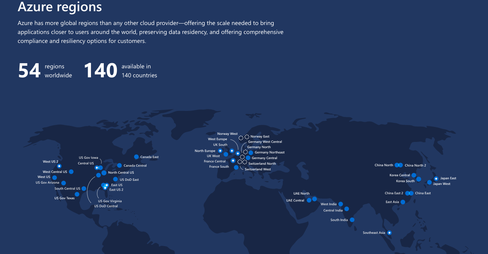

# Which Azure Region is Right to Deploy Cloud Services?

When deploying cloud services and resources, the location is a fundamental decision to consider. Depending on the datacenter location selected, there are technical and legal aspects in one region instead of another. Let’s have a walk through what this means when deploying to Microsoft Azure.

However, let’s start from the beginning and align with the concept of a datacenter location in the context of Microsoft Azure.

### What is an Azure Region?

Microsoft Azure Region is made up of data centers located around the globe. These datacenters are organized and made available to end users by region.

A region is a geographical area on the planet containing at least one, but potentially multiple datacenters that are in close proximity and networked together with a low-latency network.

For most Azure services, when you deploy a resource in Azure, you choose the region where you want your resource to be deployed. A few examples of regions are South Central Us, North Central US, Central US. Azure has more global regions than any other cloud provider. This provides the flexibility and scale needed to bring applications closer to users around the world , preserving data residency and offering comprehensive compliance and resiliency options for customer. At the time of writing this, Azure is generally available in 54 regions around the world, with plans announced for 6 additional regions.

### Region Pairs 

Each Azure region is paired with another region within the same geography \(such as US, Europe, or Asia\).This approach allows for the replication of resources \(such as virtual machine storage\) across a geography

that helps reduce the likelihood of interruptions due to events such as natural disasters, civil unrest, power outages, or physical network outages affecting both regions at once. Additional advantages of region pairs include:

* In the event of a wider Azure outage, one region out of every pair is prioritized to help reduce the time it takes to restore them for applications.
* Planned Azure updates are rolled out to paired regions one region at a time to minimize downtime and risk of application outage.
* Data continues to reside within the same geography as its pair \(except for Brazil South\) for tax and law enforcement jurisdiction purposes.
* Examples of region pairs would be North Central US paired with South Central US.
* Note: A full list of region pairs is available here.
* [https://docs.microsoft.com/en-us/azure/best-practices-availability-paired-regions](https://docs.microsoft.com/en-us/azure/best-practices-availability-paired-regions)

### Feature availability

Finally, some services or virtual machine features are only available in certain regions, such as specific virtual machine sizes or storage types. There are also some global Azure services that do not require you to select a particular region, such as Microsoft Azure Active Directory, Microsoft Azure Traffic Manager, or Azure DNS.

### Geographies

A geography is a discrete market typically containing two or more regions that preserves data residency and compliance boundaries.

Geographies allow customers with specific data-residency and compliance needs to keep their data and applications close. Geographies ensure that data residency, sovereignty, compliance, and resiliency requirements are honored within geographical boundaries. Geographies are fault-tolerant to withstand complete region failure through their connection to dedicated high-capacity networking infrastructure.

Geographies are broken up into Americas, Europe, Asia Pacific, Middle East and Africa.

### Availability Zones

Availability zones are physically separate locations within an Azure region. Each availability zone is made up of one or more datacenters equipped with independent power, cooling, and networking. It is set up to be an isolation boundary. If one availability zone goes down, the other continues working. The availability zones are typically connected to each other through very fast, private fiber-optic networks.

Availability zones allow customers to run mission-critical applications with high availability and low-latency replication.

Availability zones are offered as a service within Azure, and to ensure resiliency, there’s a minimum of three separate zones in all enabled regions.

Regions that support Availability Zones include Central US, North Europe, SouthEast Asia, and more.

### Availability Sets

Availability sets are a way for you to ensure your application remains online if a high-impact maintenance event is required, or a hardware a failure occurs. Availability sets are made up of update domains and fault domains.

* Update domains \(UD\). When a maintenance event occurs \(such as a performance update or critical security patch applied to the host\), the update is sequenced through update domains. Sequencing updates using update domains ensures that the entire datacenter isn't unavailable during platform updates and patching. Update domains are a logical section of the datacenter, and they are implemented with software and logic.
* Fault domains \(FD\). Fault domains provide for the physical separation of your workload across different hardware in the datacenter. This includes power, cooling, and network hardware that supports the physical servers located in server racks. In the event the hardware that supports a server rack becomes unavailable, only that rack of servers would be affected by the outage.

### How Do I Choose Which Azure Region is Right for Me? 

 When creating and placing resources within azure regions s there are a few considerations to take into account:

1. Each application, vm must exist in one, and only one, location. if not latency sensitive always prefer the paired region i.e North Central US,East US, East US2 which has more features as explained above or else select near by location by default.
2. You decide how you want to allocate resources to preferred regions \(North Central US,South Central US,Central US \) based on what makes the most sense for your application / vm.
3. You can move a resource from one region to another with in the US regions.
4. Resources for an application do not need to exist in the same region . However, it is recommended that you keep them in the same region for ease of management.

### References

[https://docs.microsoft.com/en-us/azure/best-practices-availability-paired-regions](https://docs.microsoft.com/en-us/azure/best-practices-availability-paired-regions)

[https://azure.microsoft.com/en-us/global-infrastructure/services/?products=all](https://azure.microsoft.com/en-us/global-infrastructure/services/?products=all)

[http://www.azurespeed.com/](http://www.azurespeed.com/)

[https://azurespeedtest.azurewebsites.net/](https://azurespeedtest.azurewebsites.net/)

