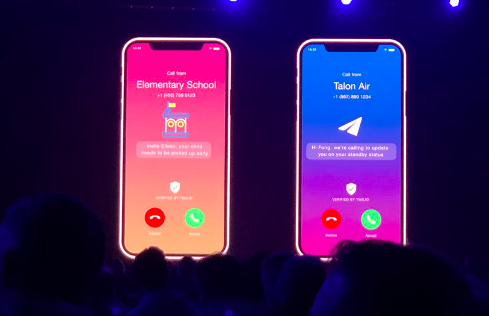

# Twilio Signal 2019 Recap

We are just back from the Twilio Signal 2019 conference in San Francisco. With over 3000 people attending, it was a huge event and crossing the golden gate bridge reminded me the most beautiful bridge in the world. Twilio has announced that they are going to run signal Moscone Center  in 2020 and I bet they’ve received a ton of advice from attendees that will help to make the 2020 event better.

Twilio usually focuses on the main keynote, sub keynotes, and product keynotes. This year conference started with Jeff Lawson CEO vision keynote. This year’s main theme was “Don’t talk about code, show it”. I love attending and listening to Jeff & Other Industry Experts from Netflix, Lyft, Door Dash, Shopify and many more companies vision toward communications and providing awesome customer experience and after the keynotes I have attended the programmable sms, voice and cloud contact center platforms workshops and tech booths.

 My highlights of the event are as follows.

**Twilio Ecosystem \| Keynote**

It’s a company **“By Developers for Developers”** with over  160,000 customers around the world and more than 6 million developers building an amazing things every day on Twilio platform. Together, building the future of engagement in communications with 750 Billion human interactions last year. That’s 32,500 calls per minute, up to 13000 peak SMS per second and reached out to 2.8 billion unique phone number annually, and 3 billion unique email address every quarter.

**Mega Trends for 2020 \| Twilio CEO**

The era of web apps and mobile apps is winding down and what next? Is it Alexa, Google Home, Sri or Bot what is it? its era of conversations - Jeff 

Conversation are eating apps as the most compelling, easiest to use and ways to engage with the customers to do business with.

After seeing the patterns from 160,000 companies Twilio learned that customers are actually trying to reach back with their questions but 75 % companies haven’t configured the inbound handlers to answer the questions. We are one among them and not listening to customer questions through channels.

For Example we sent a text message and the customer replied with blah blah  we never replied back again to customer which  we can able to fix this with technology. Interestingly when Twilio launches WhatsApp Api  51 % of the customers replied and shared the Nordstrom story of customer engagement by text messages as conversation.

Amazon, Grub hub, Shopify, Lyft, Uber, Marriot and lot tech companies already started creating this sophisticated workflows through messages and other channels.

Most importantly  lot of changes were made to RCS. which was never happened in the last 40 years of telecom industry.

**Adding a Verified Called ID \| Keynote**

A Twilio Study found that more than 75% of the calls they receive on their cell are not answered due to rise in spam and robocalls.To prevent this happening twilio empowers the consumers to know  who is calling them and why, giving them the confidence to answer the phone again and the same way with the text as well with verified by twilio branding. 

Verified By Twilio displays company branding and a reason for the call right in front of the consumer, giving them confidence in answering. its a pretty innovative service in the communication industry which will get more customer engagement.

For more information [twilio.com/verified-calls](https://t.co/Jo1nnvqnm9?amp=1).

**Modern Cloud Contact Center \| Live Demo**

Offering Flex application platform which drives the 500% more customer interactions offering software as services, flexibility of API’s and turning any idea into reality in days communicating with different channels like SMS, Voice, Video, WhatsApp, Facebook, Google and Alexa Voice Assistant all with one code change. Also, having a good integrations with Service-now, CRM, Salesforce etc.

Some of the best tech giants  like ecommerce platform shopify built and contact center MVP in 4 weeks and went to production to 4 months which reduces the operations and handle time by 30%. Lyft Contact center experience also built on top of flex which solves the problem of Omni channel and getting the customer information upfront reduces the call time.

**Twilio CLI \| Live Demo**

Simplifies the lot of Operational effort and simplifies the developer to code faster on Twilio platform. It an open source tool which is completely extensible and build our own modules.

**Twilio Send Email Validation and Ads API\| Keynote**

Introduced the real-time Email Validation API which validates email address before we send the email to patients which will decreases the bounce rates, improves sender reputation. Providing a cutting edge technology for marketers to build highly targeted display and social ad campaigns on Facebook, Instagram and Google all within the same platform.

**Building a Modern Contact Center** \| **Workshop**

During this workshop, Rob Brazier \(Sr. Director of Product, Twilio Flex\) did an introductory dive into Twilio Flex and covering how we can build, deploy and iterate the customer experience using a programmable contact center platform. Followed by the Shopify dev team to share how they have deployed an automated authentication process for 1,500 support agent using Twilio Flex all over the world.

**Connect “things” to the cloud with Cellular IoT \| Workshop**

Learned best practices to connect and authenticate an IoT device against Azure IoT Hub/Central and even push telemetry data with zero\* configuration through cellular network.

**Wrap-up**

This year Signal is probably one of the best conferences I have attended. Twilio has mastered the communication platform

