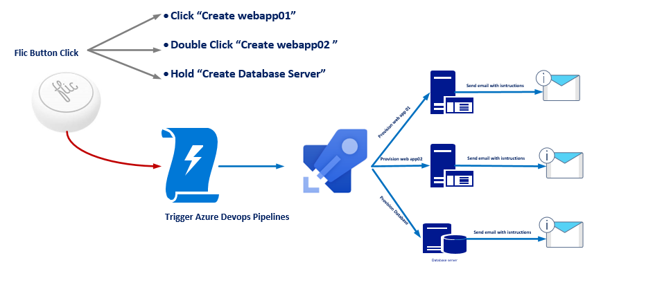
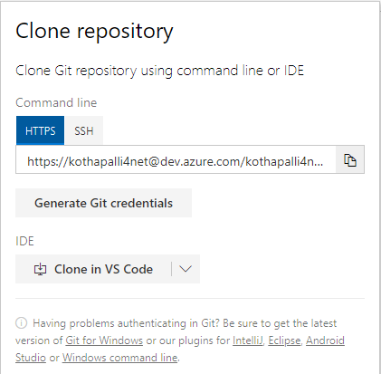

# Create servers with smart flic button in azure

Today we will build a server and databases using :

* Azure Devops
* ARM Templates
* A Flic Button

If you don't own a Flic Button, [you can purchase one here](https://flic.io/shop/flic-1pack).

Before we begin, if you're looking for a quick summary and overview on Azure Devops Pipelines \(or found this page early and would like to get a headstart\), I recommend[ starting here with the documentation](https://azure.microsoft.com/en-us/services/devops/), or taking 4 minutes to read in more detail [how to create your first devops pipeline](https://docs.microsoft.com/en-us/azure/devops/pipelines/create-first-pipeline?view=azure-devops&tabs=tfs-2018-2) , so you have some context on how to use pipelines.

#### Let Us Begin!

Today we will trigger a azure devops pipelines using a Flic button. We will start by creating a release pipelines using azure devops. Then we will create a flic account, create flic actions to trigger release pipeline

Here's a diagram of what we'll be doing:

### Create Azure Devops Account !

1. Browse to the Azure DevOps site at **http://dev.azure.com**
2. If you do not already have an account, click **Get started for free**
3.  
4. Authenticate with a Microsoft account.

### Create Demo Project 

1. Choose a name for your Project name. For the purposes of this scenario, we will use “FlicDemo” Choose Git for the source code and then click Create.
2.  
3. Once the Project is created, click on the **Repo** menu option in the left side navigation
4.  
5. On the **Repo** -&gt; File page for the **FlicDemo** repository, scroll down to the bottom of the page, then click on the **Initialize** button to get the “master” branch created.
6.  
7. Click on the **Clone** link in the upper-right
8.  
9. Copy the **HTTPS URL** for the Git repository for use in the following step
10.  
11. When prompted, login with your Microsoft Account for your **Azure DevOps** Account
12.  

### Author ARM Templates 

### Create your First CI&CD Pipelines 

### Lets Trigger a pipeline using Flic Button 

