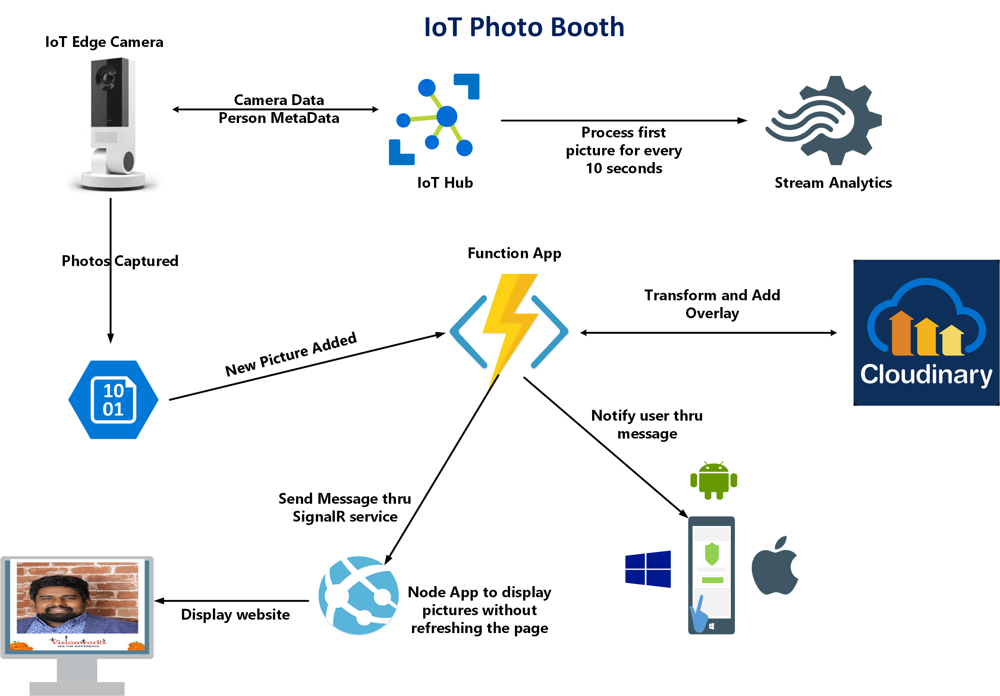

# Implement IoT Photo Booth

## Summary

This is a quick proof of concept using various Azure AI services that allows the users to take the pictures at the photo booth without any human interaction using the power of Artificial Intelligence. This project builds on the basic features already installed in the Vision AI DevKit getting started Module, Custom Build Capture Module Container. Using the default ML model for object detection, this project takes a screenshot when one or more people are detected in frame. It send these data to cloud \(using IoTHub\). Data is processed using [**Azure Stream Analytics**](https://azure.microsoft.com/en-us/services/stream-analytics/), while the most important part is, that the processing consist also from [**Cloudinary**  ](https://cloudinary.com)API, thanks to which we are able to transform pictures real-time, [**Twilio**](https://www.twilio.com/) to send the pictures as a Text message and [**Azure SignalR**](https://azure.microsoft.com/en-us/services/signalr-service/) ****service to display the pictures on TV, when the person is identified. Solution is proactively sending notifications after there is a new person in the photo booth area, to TV and mobile device. For further details see architecture of solution below:

## Solution Architecture

Probably the quickest way how to give you overview of all the services used within this solution is to share the architecture diagram, so here it is:



## Software's, Hardware and Services Used

* Vision AI DevKit Camera 
* Azure IoT Edge
* IoT Hub
* Azure Storage
* Azure Functions                                   
* Azure SignalR
* Twilio
* Cloudinary
* C\#
* Node.js

## Implementation

As stated this solution provides capability to capture people in Photo booth area and is also capable to transform collected information. It is aiming on scenarios, when you want to take a selfie at the selfie station. 

There are two important parts to the solution. First is intelligent device - Vision AI DevKit deployed "on the edge". This camera is capable of hardware acceleration of AI models and it runs Azure IoT Edge. It is capable of detecting persons, capturing photos and uploading them to Azure for further processing \(face identification\). 

Second part to the solution is basically solution backend and presentation layer responsible for image/data processing, transforming and communicating.

Now let's walk thru the solution details, from video stream processing to entries data presentation layer.

### Photos capturing

Photo capture happens of course on the edge - on the Vision AI Dev Kit Camera. In order to make solution efficient, it was needed to find a way how to run face identification in the cloud only for pictures containing persons. To achieve that, there are three modules deployed to DevKit, namely [_AI Vision Dev Kit Get Started Module_](https://github.com/microsoft/vision-ai-developer-kit/tree/master/samples/official/ai-vision-devkit-get-started/modules/AIVisionDevKitGetStartedModule) with default custom vision model, _Azure Stream analytics module_ - and _Capture module_. The whole capture process works the following way:

1. _AI Vision Dev Kit Get Started Module_ continuously processes captured video and detects objects in the captured video stream. In case object is detected it sends telemetry message into edge hub. Every message originating from this module is routed to stream analytics module.
2. Azure Stream Analytics module named _ASAEdgeFilter_ reads the messages and filters out every message which does not contain label with value _Person_. Moreover, it picks up only first message in every 10 second window. This is simple logic to achieve to not to capture multiple pictures of the same entrant, but in case of production scenario it should be changed, to comply with specifics of the scenario. Messages selected by ASA Edge Filter module are directed to _Capture Module_. ASA Job is defined as follows:

```sql
SELECT
    label, confidence, System.TimeStamp as timestamp
INTO
    Output
FROM
    Input
WHERE
  ( IsFirst(second, 10) OVER (When label = 'person' AND confidence >= 60) = 1)
```

 You can find the whole _ASAEdgeFilter_ project in the _VisionDevKitModules_ folder in the Azure DevOps repository.

_Capture module_ is initialized by any incoming message to it's input. It connects to mpeg stream provided by AI Vision Dev Kit Get Started Module and using ffmpeg library it creates photo captures and uploads them to Azure Storage container. You can find detailed documentation and Capture module code in the Azure DevOps repository.

 You can find generalized IoT Edge deployment template in _VisionDevKitModules_ folder in the Azure Devops repository. Note that you will need to build and push capture module to azure container repository and publish _ASAEdgeFilter_ job to your Azure subscription and reference them in your deployment template. You can run also Web Stream module, which enables you to view almost real time video output from _AI Vision Dev Kit Get Started Module_.

### Processing captures

As stated for data ingress I have used Azure IoT Hub Service, which is able to ingress millions of messages per second, and thus gives a lot of space to scale this solution and support communication thousands of IoT edge devices. Besides receiving of messages I used IoT Hub to easily communicate to device \(as stated in previous section\). Initial data processing is done thru Stream Analytics Service. It also filter messages, which contain image reference and writes these messages to storage blob, where it gets picked up by Azure function.

#### Processing Capture function

Captured photos are being picked up by Photo_Processor_ - C\# Azure Function, which gets triggered by every new file uploaded to storage container. First Capture Processor transforms the picture using Cloudinary API. Subsequently it sends SMS using Twilio service  and displayed on the TV using Azure SignalR service. For more information on the SignalR and the front end  follow here : **https://github.com/asubramnaian/projectname**

PhotoBooth Processor function code is stated bellow. Notice, how simple it was to implement Cloudinary and also send SMS message, thanks to functions bindings. For full implementation see the Azure DevOps repository



```csharp
[FunctionName("ProcessCapture")]
        public static async void Run([BlobTrigger("pictures/{name}", Connection = "AzureWebJobsStorage")]Stream myBlob, [SignalR(HubName = "broadcast")]IAsyncCollector<SignalRMessage> signalRMessages, string name,
            ILogger log)
        {
            const string accountSid = "Twilio SID";
            const string authToken = "Twilio Auth Token";           

            Account account = new Account(
                "Clouniary Account ID",
                "Clouniary Account Key",
                "Clouniary Account Password");

            try
            {
                Cloudinary cloudinary = new Cloudinary(account);
                TwilioClient.Init(accountSid, authToken);


                var uploadParams = new ImageUploadParams()
                {
                    File = new FileDescription(name, myBlob),
                    PublicId= name,
                    EagerTransforms = new List<Transformation>()
                    {
                        new Transformation().AspectRatio("0.75").Crop("crop").Chain().Height(600).Crop("scale").Chain().Flags("relative").Height(1.0).Overlay(new Layer().PublicId("overlay-photo")).Width(1.0).Crop("scale")
                    }

                };
                var stopwatch = new Stopwatch();
                stopwatch.Start();
                
                var uploadResult = cloudinary.Upload(uploadParams);

                stopwatch.Stop();
                var elapsed_time = stopwatch.ElapsedMilliseconds;
                log.LogInformation(elapsed_time.ToString());

                var secureurl = (string)uploadResult.JsonObj["eager"][0]["secure_url"];

                await signalRMessages.AddAsync(new SignalRMessage()
                {
                    Target = "notify",
                    Arguments = new object[] { secureurl }
                });

                var mediaUrl = new[] {
                     new Uri(secureurl)
                  }.ToList();

                var message = MessageResource.Create(
                    from: new Twilio.Types.PhoneNumber("From Number"),
                    mediaUrl: mediaUrl,
                    to: new Twilio.Types.PhoneNumber("To Number")
                    );


                log.LogInformation($"Completed Image Processing");

                log.LogInformation($"Succesfully Transaformed Image:\n Url:{mediaUrl}");
            }
            catch (Exception e)
            {

                log.LogInformation(e.Message);
            }

            log.LogInformation($"Succesfully processed blob:\n Name:{name} \n Size: {myBlob.Length} Bytes");
        }
```



```csharp
[FunctionName("negotiate")]
        public static IActionResult Run([HttpTrigger(AuthorizationLevel.Anonymous, "post")]HttpRequest req,
                                            [SignalRConnectionInfo(HubName = "broadcast")]SignalRConnectionInfo info,
                                            TraceWriter log)
        {
            return info != null
                ? (ActionResult)new OkObjectResult(info)
                : new NotFoundObjectResult("Failed to load SignalR Info.");
        }
```




## Future Improvements

 Like mentioned above this is a quick proof of concept integrating the power of Azure IoT in the cloud with initial inference running on the intelligent edge device. The Azure IoT has many more features.  
Using the above API documentation extending the features of this project should be straight forward. One example would be to verify the identity of the person  using Azure Face API


